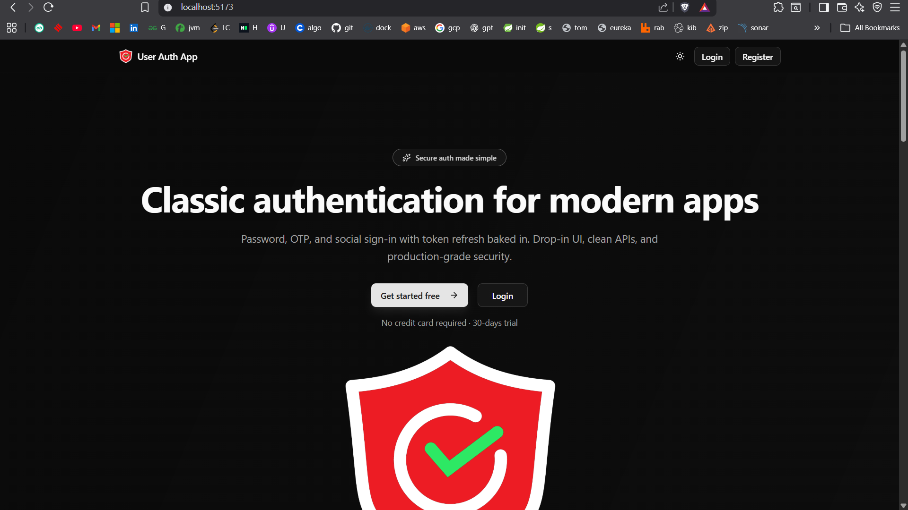
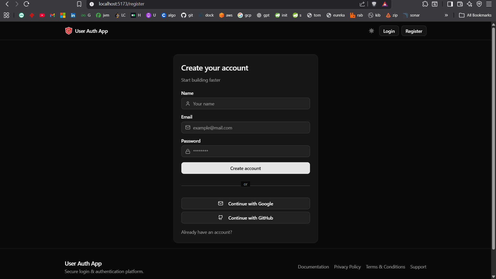
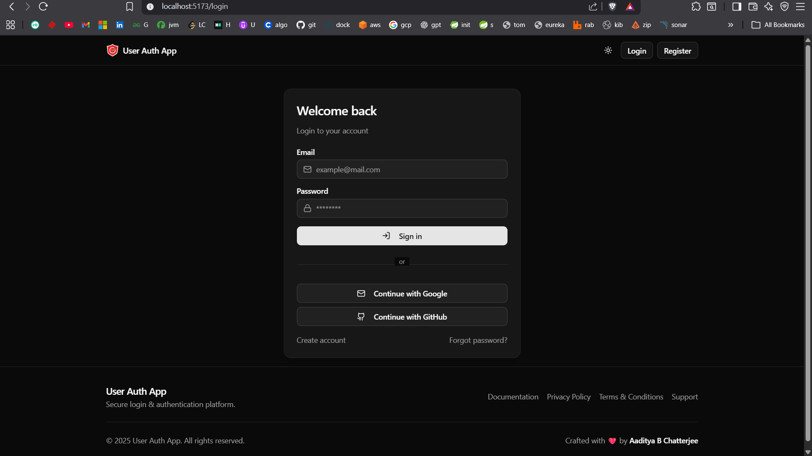
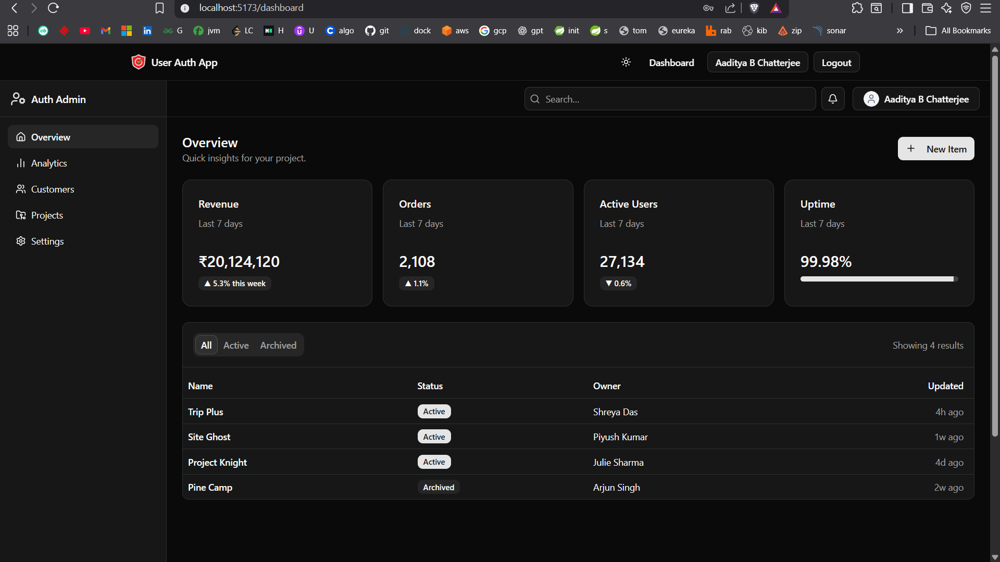
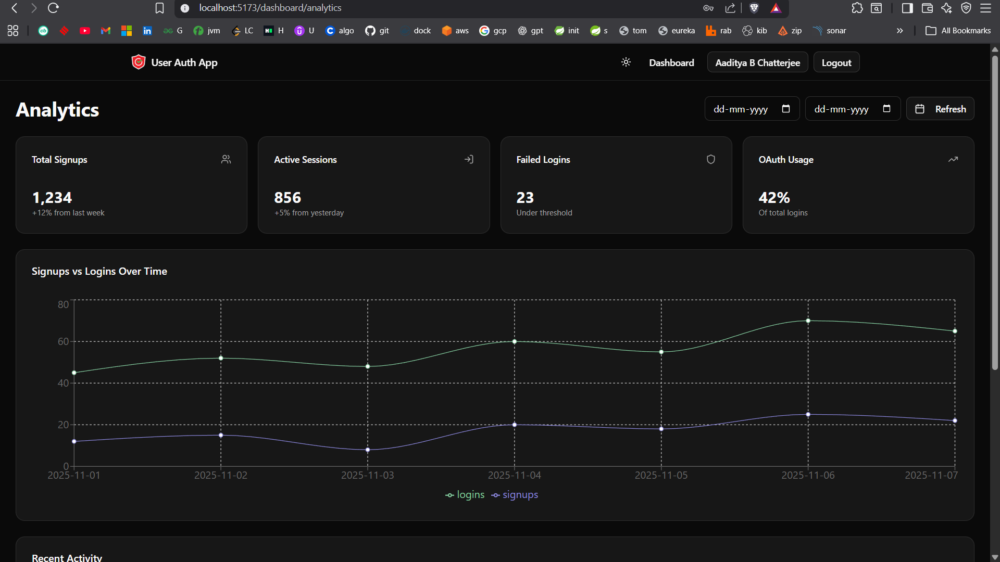
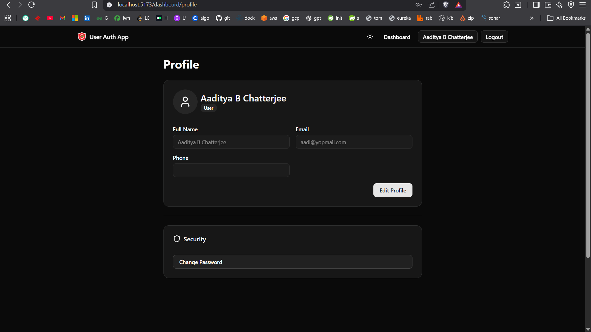
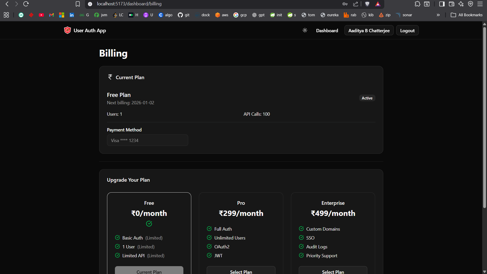

# User Auth App - [🔐 A Full Stack User Authentication App — React + Vite + Spring Boot]

A complete **authentication system** built using **React (Vite)** on the frontend and **Spring Boot** on the backend.  
Supports **JWT-based authentication** with **username/password login**, as well as **Google** and **GitHub OAuth2 login**.

[](https://reactjs.org/) [](https://spring.io/projects/spring-boot) [](https://www.postgresql.org/) [](LICENSE)

---

## 🧱 Tech Stack

### 🖥️ Frontend

- React 18.x (Vite)
- Tailwind CSS
- Axios (for API calls)
- React Router DOM
- ShadCN UI Components
- Zustand (state management)
- React Hot Toast (notifications)

### ⚙️ Backend

- Spring Boot 3.5.7
- Spring Security 6.5.6
- Spring Data JPA + Hibernate 6.6
- PostgreSQL (with HikariCP connection pooling)
- OAuth2 Client (Google, GitHub)
- JWT Authentication (JJWT 0.11.5)
- Lombok, SpringDoc OpenAPI (Swagger UI)
- dotenv-java (for .env support)

---

## 📸 Screenshots

### Home page



### Register page



### Login page



### Dashboard



### Analytics page



### Profile page



### Billing page



---

## 📁 Project Structure

```
user-auth-app/
│
├── user-auth-backend/        # Spring Boot Backend
│   ├── src/main/
│   │   ├── java/org/aadi/userauth/
│   │   └── resources/application.yml
│   ├── pom.xml
│   └── .env.example
│
├── user-auth-frontend/       # React + Vite Frontend
│   ├── src/
│   │   ├── components/
│   │   ├── pages/
│   │   ├── utils/
│   │   └── services/
│   ├── public/
│   ├── package.json
│   ├── vite.config.js
│   └── .env.example
│
├── README.md
└── LICENSE
```


---

## Major Pending Task
- Verify email with OTP
- Forget password using email OTP
- Reset new password using old password

---

## ⚙️ Backend Setup (Spring Boot)

### 🧩 Prerequisites

- Java 21+ (or 25)
- Maven 3.9+
- PostgreSQL 16+ (local or cloud like Neon)
- Git

### 🧰 Steps to Run Backend

1. Clone and navigate to the backend folder:

   ```bash
   git clone <repo-url>
   cd user-auth-backend
   ```

2. Create a PostgreSQL database:

   ```sql
   CREATE DATABASE user_auth_app;
   -- Optional: Create user with privileges
   CREATE USER auth_user WITH PASSWORD 'secure_password';
   GRANT ALL PRIVILEGES ON DATABASE user_auth_app TO auth_user;
   ```

3. Copy `.env.example` to `.env` and fill in values:

   ```
   DB_URL=jdbc:postgresql://localhost:5432/user_auth_app
   DB_USERNAME=postgres  # or your DB user
   DB_PASSWORD=your_db_password
   JWT_SECRET=your-64-char-random-jwt-secret-here
   JWT_ISSUER=user-auth-backend
   JWT_ACCESS_TTL_SECONDS=900
   JWT_REFRESH_TTL_SECONDS=1209600
   JWT_REFRESH_COOKIE_NAME=refresh_token
   JWT_COOKIE_SECURE=false  # Set true in production
   JWT_COOKIE_SAME_SITE=Lax
   GITHUB_CLIENT_ID=your-github-client-id
   GITHUB_CLIENT_SECRET=your-github-client-secret
   GOOGLE_CLIENT_ID=your-google-client-id
   GOOGLE_CLIENT_SECRET=your-google-client-secret
   ALLOWED_ORIGINS=http://localhost:5173
   AUTH_SUCCESS_REDIRECT=http://localhost:5173/dashboard
   AUTH_FAILURE_REDIRECT=http://localhost:5173/login?error=true
   ```

4. Configure `application.yml` (overrides .env where needed; uses `${VAR}` placeholders):

   ```yaml
   server:
     port: 8081

   spring:
     application:
       name: user-auth-backend

     # PostgreSQL DB configuration
     datasource:
       url: ${DB_URL:jdbc:postgresql://localhost:5432/user_auth_app}
       username: ${DB_USERNAME:postgres}
       password: ${DB_PASSWORD}
       hikari:
         pool-name: auth-hikari
         maximum-pool-size: 10
         minimum-idle: 2
         idle-timeout: 30000
         connection-timeout: 20000
         max-lifetime: 1800000
         validation-timeout: 5000
         leak-detection-threshold: 0
         initialization-fail-timeout: -1

     jpa:
       hibernate:
         ddl-auto: update  # Use 'validate' or Flyway in prod
       show-sql: true
       properties:
         hibernate:
           dialect: org.hibernate.dialect.PostgreSQLDialect
       database-platform: org.hibernate.dialect.PostgreSQLDialect

     # OAuth2 configuration
     security:
       oauth2:
         client:
           registration:
             google:
               client-id: ${GOOGLE_CLIENT_ID}
               client-secret: ${GOOGLE_CLIENT_SECRET}
               redirect-uri: "{baseUrl}/login/oauth2/code/{registrationId}"
               scope: [email, profile, openid]
             github:
               client-id: ${GITHUB_CLIENT_ID}
               client-secret: ${GITHUB_CLIENT_SECRET}
               redirect-uri: "{baseUrl}/login/oauth2/code/{registrationId}"
               scope: [user:email, read:user]
           provider:
             github:
               authorization-uri: https://github.com/login/oauth/authorize
               token-uri: https://github.com/login/oauth/access_token
               user-info-uri: https://api.github.com/user
               user-name-attribute: id

   # JWT and App Configs (with fallbacks)
   security:
     jwt:
       secret: ${JWT_SECRET:default-secret-change-in-prod}
       issuer: ${JWT_ISSUER:user-auth-backend}
       access-ttl-seconds: ${JWT_ACCESS_TTL_SECONDS:900}  # 15 min
       refresh-ttl-seconds: ${JWT_REFRESH_TTL_SECONDS:1209600}  # 14 days
       refresh-cookie-name: ${JWT_REFRESH_COOKIE_NAME:refresh_token}
       cookie-secure: ${JWT_COOKIE_SECURE:false}
       cookie-same-site: ${JWT_COOKIE_SAME_SITE:Lax}

   app:
     cors:
       allowed-origins: ${ALLOWED_ORIGINS:http://localhost:5173,http://localhost:3000}
     auth:
       success-redirect: ${AUTH_SUCCESS_REDIRECT:http://localhost:5173/dashboard}
       failure-redirect: ${AUTH_FAILURE_REDIRECT:http://localhost:5173/login?error=true}

   logging:
     level:
       org.springframework.security: DEBUG
       org.aadi.userauth: DEBUG
   ```

5. Run the Spring Boot app:

   ```bash
   mvn clean spring-boot:run
   ```

    - Access Swagger UI at **http://localhost:8081/swagger-ui.html** for API docs.

📍 Backend runs on **http://localhost:8081**. First run creates tables via Hibernate.

---

## 💻 Frontend Setup (React + Vite)

### 🧩 Prerequisites

- Node.js 18+
- npm / yarn / pnpm

### 🧰 Steps to Run Frontend

1. Navigate to frontend directory:

   ```bash
   cd user-auth-frontend
   ```

2. Install dependencies:

   ```bash
   npm install
   ```

3. Copy `.env.example` to `.env` and configure:

   ```
   VITE_BACKEND_URL=http://localhost:8081
   VITE_APP_NAME=User Auth App
   ```

4. Start development server:

   ```bash
   npm run dev
   ```

📍 Frontend runs on **http://localhost:5173**. Proxy API calls to backend via Vite config.

---

## 🔗 Authentication Flow

1. **User Login (Email/Password):**
    - User submits credentials via form.
    - Frontend calls `/api/auth/login`; backend verifies & returns JWTs.
    - Store access token in memory; refresh in httpOnly cookie.

2. **OAuth Login (Google / GitHub):**
    - Click provider button → Redirect to `/oauth2/authorization/{provider}`.
    - Backend handles callback, fetches user info, creates/issues JWTs.
    - Redirect back to frontend with success/failure.

3. **Token Refresh:**
    - On 401 errors, call `/api/auth/refresh` silently using cookie.
    - Backend validates refresh token & issues new access token.

4. **Protected Routes & Logout:**
    - Use Zustand store for auth state; interceptors for token attachment.
    - Logout clears store/cookies; calls `/api/auth/logout` to invalidate.

---

## 🔑 Example API Endpoints

| Method | Endpoint                       | Description                          | Auth Required |
|--------|--------------------------------|--------------------------------------|---------------|
| `POST` | `/api/auth/register`           | Register new user (email/password)   | No            |
| `POST` | `/api/auth/login`              | Login with email & password          | No            |
| `GET`  | `/api/auth/me`                 | Get current user profile             | Yes (JWT)     |
| `GET`  | `/oauth2/authorization/google` | Initiate Google OAuth flow           | No            |
| `GET`  | `/oauth2/authorization/github` | Initiate GitHub OAuth flow           | No            |
| `POST` | `/api/auth/refresh`            | Refresh access token                 | Yes (Refresh) |
| `POST` | `/api/auth/logout`             | Invalidate session & clear tokens    | Yes (JWT)     |

- **Error Handling**: Returns 400/401/403 with JSON `{ "error": "message" }`.
- **Swagger**: Test endpoints at `/swagger-ui.html`.

---

## 🧠 Environment Variables Summary

| Variable                  | Description                          | Example / Default                                   |
|---------------------------|--------------------------------------|-----------------------------------------------------|
| `DB_URL`                  | PostgreSQL JDBC URL                  | `jdbc:postgresql://localhost:5432/user-auth-app-db` |
| `DB_USERNAME`             | DB username                          | `postgres`                                          |
| `DB_PASSWORD`             | DB password                          | (Secure value)                                      |
| `JWT_SECRET`              | JWT signing secret (min 64 chars)    | `your-very-long-random-secret-key`                  |
| `JWT_ISSUER`              | JWT issuer claim                     | `user-auth-backend`                                 |
| `JWT_ACCESS_TTL_SECONDS`  | Access token expiry (seconds)        | `900` (15 min)                                      |
| `JWT_REFRESH_TTL_SECONDS` | Refresh token expiry (seconds)       | `1209600` (14 days)                                 |
| `JWT_COOKIE_SECURE`       | Secure cookie flag (prod: true)      | `false` (dev)                                       |
| `GITHUB_CLIENT_ID`        | GitHub OAuth client ID               | (From GitHub App settings)                          |
| `GITHUB_CLIENT_SECRET`    | GitHub OAuth client secret           | (From GitHub App settings)                          |
| `GOOGLE_CLIENT_ID`        | Google OAuth client ID               | (From Google Console)                               |
| `GOOGLE_CLIENT_SECRET`    | Google OAuth client secret           | (From Google Console)                               |
| `VITE_BACKEND_URL`        | Backend base URL (frontend only)     | `http://localhost:8081`                             |

**Tip**: Use `.env` files (ignored by Git) for secrets. Restart after changes.

---

## 🧰 Common Commands

| Task                  | Command                          |
|-----------------------|----------------------------------|
| Install backend deps  | `mvn clean install`              |
| Run backend dev       | `mvn spring-boot:run`            |
| Build backend JAR     | `mvn clean package`              |
| Run backend JAR       | `java -jar target/user-auth-backend-0.0.1-SNAPSHOT.jar` |
| Install frontend deps | `npm install`                    |
| Run frontend dev      | `npm run dev`                    |
| Build frontend        | `npm run build`                  |
| Lint & format         | `npm run lint` (frontend)        |


---

## 🧩 Deployment Tips

- **Database**: Use managed Postgres (Neon) for prod. Set `ddl-auto=validate`.
- **Build & Serve**:
    - Frontend: `npm run build` → Copy `dist/` to backend `src/main/resources/static`.
    - Backend: `mvn package` → Deploy JAR to Heroku/Render/AWS.
- **Separate Hosts**:
    - Frontend: Vercel/Netlify (set `VITE_BACKEND_URL=https://your-backend.com`).
    - Backend: Railway/DigitalOcean/Render (enable HTTPS).
- **Security**:
    - Prod: `JWT_COOKIE_SECURE=true`, `SameSite=Strict`.
    - Use HTTPS everywhere; add rate limiting (Spring Security).
    - OAuth: Configure valid redirect URIs in Google/GitHub consoles.
- **Monitoring**: Add Spring Boot Actuator (`/actuator/health`) for health checks.

---

## 🪪 License

This project is licensed under the **MIT License**.  
See [LICENSE](LICENSE) for details.

You are free to use, modify, and distribute it for learning, personal, or commercial purposes.

---

⭐ **If this project helped you, consider giving it a star!**  
[GitHub Repo](https://github.com/AadityaUoHyd/user-auth-app) | [Issues](https://github.com/AadityaUoHyd/user-auth-app/issues) | [Contribute](https://github.com/your-username/user-auth-app/pulls)